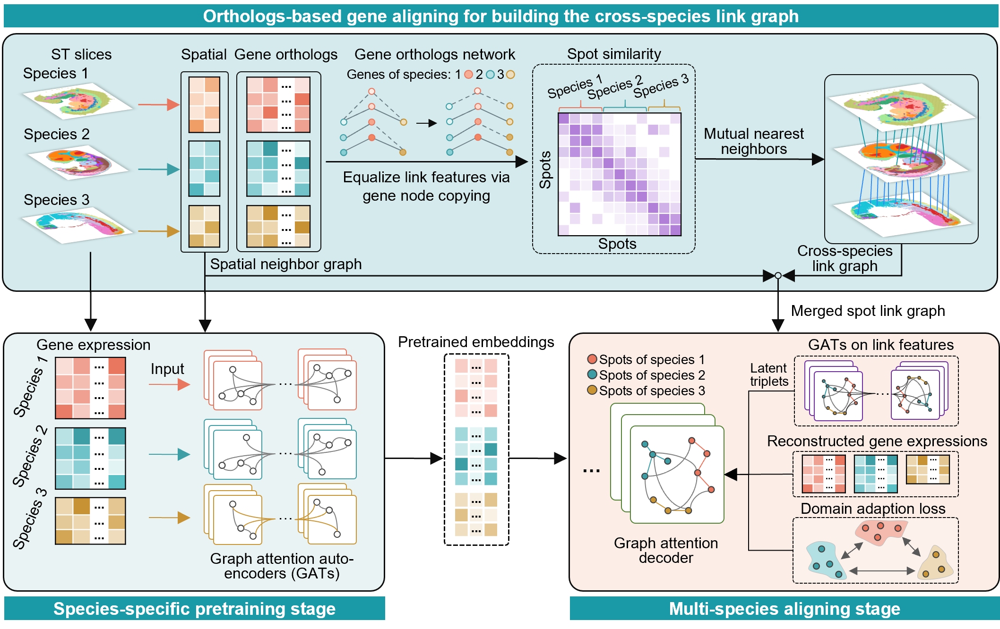

# STACAME




## Overview

STACAME is designed for cross-species alignment and integration of spatially resolved transcriptomics data.

**a**. In the preprocessing step, spatial neighbor networks are constructed within each species using Euclidean distances between spot coordinates. An expression matrix of equal gene length (X_e) is generated by mapping orthologous genes across species. Cross-species spot correspondences are then initially inferred using either the Mutual Nearest Neighbors (MNN) algorithm or, optionally, k-Nearest Neighbors (k-NN). In the pretraining step, homologous and species-specific highly variable genes (HVGs) are selected as input features for a graph attention network (GAT), where the graph topology is defined by the intra-species spatial neighbor network. In the integration step, pretrained embeddings are aligned and decoded through another GAT that incorporates cross-species edges to reconstruct gene expression (optimized via mean squared error loss). Cross-species triplets are constructed by identifying inter-species MNN spot pairs in both the gene expression space and the latent space, where the latent space is generated by an auxiliary lightweight graph attention autoencoder using the PCA of X_e. And Maximum Mean Discrepancy (MMD) and adversarial (GAN) losses are applied to facilitate domain adaptation. 

**b**., Applications enabled by STACAME include cross-species domain alignment, identification of evolutionarily conserved or divergent spatially variable genes, comparative analysis of organ development across species, and three-dimensional integration of spatial transcriptomics (ST) data from multiple species.


## Installation
The STACAME package is developed based on the Python libraries [Scanpy](https://scanpy.readthedocs.io/en/stable/), [PyTorch](https://pytorch.org/) and [PyG](https://github.com/pyg-team/pytorch_geometric) (*PyTorch Geometric*) framework, and can be run on GPU (recommend) or CPU.


First clone the repository. 

```
git clone https://github.com/saulgoodenough/STACAME.git
cd STACAME
```

It's recommended to create a separate conda environment for running STACAME:

```
#create an environment called stacame
conda create -n stacame python=3.11

#activate your environment
conda activate stacame
```
Install pytorch (>= 2.7.1) and torch_geometric depends on your GPU and cuda version. 
The torch-geometric library is required, please see the installation steps in https://github.com/pyg-team/pytorch_geometric#installation

```
pip install torch==2.7.1 torchvision==0.22.1 torchaudio==2.7.1 --index-url https://download.pytorch.org/whl/cu128

pip install torch_geometric

# Optional dependencies:
pip install pyg_lib torch_scatter torch_sparse torch_cluster -f https://data.pyg.org/whl/torch-2.7.0+cu128.html
```

Install all the required packages. 

The use of the mclust algorithm requires the rpy2 package (Python) and the mclust package (R). See https://pypi.org/project/rpy2/ and https://cran.r-project.org/web/packages/mclust/index.html for detail.

```
pip install -r .\pip.txt

conda install r-base r-mclust -c conda-forge

pip install rpy2

pip install ipykernel

python -m ipykernel install --user --name stacame --display-name "stacame" 
```

if there is an error of rpy2, make sure that rpy2 is the right version:
```
conda install -c conda-forge rpy2==3.5.11
```

Install STACAME.
```
python setup.py build
python setup.py install
```


## Tutorials

Three step-by-step tutorials are included in the `Tutorial` folder and https://STACAME.readthedocs.io/en/latest/ to show how to use STACAME. 

- [Tutorial 1: Integrating human and macaque DLPFC slices (10x Visium, Stereo-seq)](./Tutorials/Tutorial1_DLPFC.ipynb)
- [Tutorial 2: Integrating mouse, marmoset and macaque hippocampus (Stereo-seq)](./Tutorials/Tutorial2_Hippocampus_3species.ipynb)
- [Tutorial 3: Integrating mouse and macaque hippocampus slices across sequencing platforms (Slide-seqV2, Stereo-seq)](./Tutorials/Tutorial3_Hippocampus_crossplatform.ipynb)
- [Tutorial 4: Integrating mouse and human cortex slices (MERFISH)](./Tutorials/Tutorial4_Cortex_MERFISH.ipynb)
- [Tutorial 5: Integrating zebrafish and mouse embyros of multistages (Stereo-seq)](./Tutorials/Tutorial5_Embryo_multistages.ipynb)
- [Tutorial 6: Integrating zebrafish, mouse and human embyros (10x Visium, Stereo-seq)](./Tutorials/Tutorial6_Embryo_threespecies.ipynb)
- [Tutorial 7: Integrating mouse (AD) and macaque (normal) hippocampal slices (Slide-seqV2, Stereo-seq)](./Tutorials/Tutorial7_AD.ipynb)
- [Tutorial 8: Integrating mouse and human breast cancer slices (10x Visium, 10x Xenium)](./Tutorials/Tutorial8_BC.ipynb)
- [Tutorial 9: Integrating mouse, marmoset and macaque 3D reconstructed cerebellums (Stereo-seq)](./Tutorials/Tutorial9_Cerebellar_subgraph.ipynb)
- [Tutorial 10: Spatial cell type prediction across mouse, marmoset and macaque cerebellum slices (Stereo-seq)](./Tutorials/Tutorial10_Spatial_celltype_prediction.ipynb)


## Support
If you have any questions, please feel free to contact us [biaozhang@ysu.edu.cn](mailto:biaozhang@ysu.edu.cn) or [biaozhang2022@126.com](mailto:biaozhang2022@126.com). 


## Citation
Biao Zhang, Xiang Zhou, Shuqin Zhang and Shihua Zhang. "STACAME". 2025.

